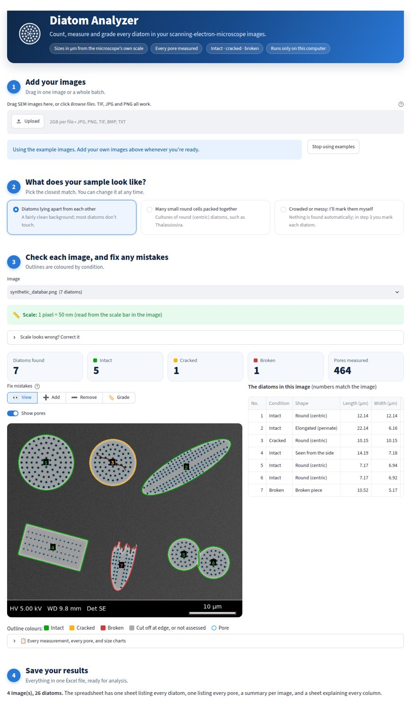

# Diatom Analyzer

**Drop in SEM images of diatoms. Get every diatom counted, measured in µm and graded intact, cracked
or broken, with every pore, in one Excel file.** Open source, runs on a laptop, no programming needed.



## What it does

| You need | You get |
|---|---|
| Count every diatom | Each one outlined and numbered on the image; touching diatoms are separated |
| Size in µm | Length, width, diameter and area. The scale comes from the microscope's file or the scale bar on the image, **never a fixed pixel size** |
| Orientation | The long-axis angle (0-180°), and whether it lies face-on (valve) or on its side (girdle) |
| Condition | Intact, cracked or broken, colour-coded on the image |
| Shape or species | Round (centric), elongated (pennate), side view or broken piece; species names once you teach it a few examples |
| Pores | Every pore's position and diameter in µm, plus pore density, spacing and porosity per diatom |

Everything runs on your own computer: no cloud, no GPU, and no images leave the machine.

---

## Getting started

**Once per computer** (about 10 minutes):

1. **Install Python** (version 3.10 or newer) from [python.org/downloads](https://www.python.org/downloads/).
   On Windows, tick **"Add python.exe to PATH"** on the first screen of the installer.
2. **Get the Diatom Analyzer folder:** on this project's GitHub page click the green **Code** button →
   **Download ZIP**, and unzip it somewhere easy to find, such as your Desktop.

**Every time:** open the folder and double-click

- **Mac:** `Start Diatom Analyzer (Mac).command`. The first time, macOS may say it can't check the file:
  **right-click (or Control-click) it → Open → Open**. After that a normal double-click works.
- **Windows:** `Start Diatom Analyzer (Windows).bat`. If *Windows protected your PC* appears, click
  **More info → Run anyway**.

The first start installs what it needs (a few minutes, internet needed once); after that it opens in
about ten seconds, in your web browser. A black window opens with it and must stay open while you work.
**To quit,** close the browser tab and then the black window.

*(Optional)* To read scale-bar text on images that don't store their scale, install
[Tesseract](https://github.com/UB-Mannheim/tesseract/wiki) (Windows) or run `brew install tesseract`
(Mac). Without it, the app asks you what the scale bar says. Phenom and Hitachi images store their
scale in the file and don't need it.

## Using the app: four steps

1. **Add your images.** Drag SEM images (TIF, JPG or PNG; a whole batch is fine) into the box. For
   Hitachi or JEOL images, also add the `.txt` file saved with each image: it holds the scale.
   No images to hand? Click *Try it with example images*.
2. **Pick what your sample looks like.** Click one of three cards:
   - *Diatoms lying apart from each other*: found automatically.
   - *Many small round cells packed together* (e.g. *Thalassiosira* cultures): say roughly how wide one
     cell is. Condition isn't graded in this mode.
   - *Crowded or messy: I'll mark them myself*: nothing is found automatically; you mark each diatom
     in step 3.
3. **Check each image, and fix any mistakes.** Pick an image from the list. The green box says where the
   scale came from (if it's wrong, open *Scale looks wrong? Correct it*). The tiles give the counts,
   and the table lists every diatom by the number on the image. To fix something, choose a tool above
   the image:
   - **➕ Add:** drag from one tip of a missed diatom to the other (or click the centre of a round one);
     the outline is traced for you.
   - **➖ Remove:** click an outline that isn't a diatom.
   - **🏷️ Grade:** pick intact, cracked or broken, then click a diatom. Use it for diatoms you added
     (they start as *not assessed*) or when you disagree with the tool.
   - **↶ Undo** takes back the last change; **Start over** clears your changes to that image.
4. **Save your results.** One Excel file for all images, plus the marked-up pictures as a ZIP.

**What the colours mean**

| Outline | Meaning |
|---|---|
| 🟩 green | Intact |
| 🟨 amber | Cracked: a crack line or a small chip |
| 🟥 red | Broken: a sharp inward corner, a bite out of the edge, or a very irregular shape |
| ⬜ grey | Cut off by the image edge, or not assessed |
| 🔵 blue ring | A pore |

**More tools** (bottom of the page): a short how-to, *teach the tool species names* (pick a few diatoms by
number and name the species; from then on it suggests names), and *save training examples* for a
detection model (see *Training a detection model*). Fine-tuning settings are in the collapsed
**Expert settings** panel (» at the top left); everyday use never needs them.

**For developers:** `pip install -r requirements.txt` then `streamlit run app.py` starts the same app.

### Batch mode (command line)

```
python -m diatom_analyzer path/to/images/ -o results.xlsx --overlays annotated/
```
Useful options: `--bar-um 10` (the scale bar in every image is 10 µm), `--um-per-px 0.0123`,
`--library species_library`, `--min-size-um 5`, `--no-ocr`. Run with `--help` for the full list.

## The spreadsheet

| Sheet | One row per | Key columns |
|---|---|---|
| Summary | image | frustule count, damage breakdown, morphotypes, species, µm/px and its source, warnings |
| Frustules | frustule | species, morphotype, view, damage, length/width/diameter/area (µm), orientation, pore count, porosity, pore density and spacing, shape metrics |
| Pores | pore | x/y (µm from the top-left corner), along/across (µm, in the frustule's own axis frame), diameter, area, major/minor axis |
| Settings | setting | software version, run time, every threshold |
| Column guide | column | plain-language definition of every column |

## How it works

```
image ─► scale ─► find frustules ─► measure ─► pores & cracks ─► species match ─► damage ─► spreadsheet
```

**1. Scale** (`calibration.py`), in priority order:
1. A value you type in (per image or for all images).
2. Microscope metadata: FEI/Thermo Fisher and Zeiss TIFF tags, ImageJ calibration, and the `.txt`
   sidecar files written by JEOL and Hitachi instruments. Screen-DPI tags (72/300 dpi) are ignored.
3. The burned-in scale bar: the longest isolated, solid horizontal bar is measured in pixels and its
   label ("10 µm", "500 nm") is read by OCR. Implausible readings are rejected, and unusual values
   (e.g. "9 µm") are flagged for checking.
4. The *HFW* (horizontal field width) text printed on FEI/Thermo information bars.

When both metadata and a readable scale bar exist, they are cross-checked. A disagreement usually means
the image was resized after acquisition, and it is flagged in the results. The instrument information
strip at the bottom of the image is detected and excluded from analysis.

**2. Frustules** (`segmentation.py`): smoothing, removal of uneven illumination/charging with a
background-surface fit, automatic (Otsu) thresholding, closing of pore-sized gaps at the margin, hole
filling, and a conservative watershed split that separates touching frustules without cutting long
pennates in two. An optional [Cellpose](https://github.com/MouseLand/cellpose) deep-learning backend
can be switched on after `pip install cellpose`.

**3. Measurements** (`measurements.py`): length and width from the tightest rotated bounding box,
orientation from image moments, and shape descriptors (solidity, ellipse fit, rectangle fill, notch
depth). **View**: girdle views have rectangular outlines (rectangle fill ≈ 1) and valve views are
elliptical (≈ 0.79). **Morphotype**: centric (round), pennate elliptic, pennate linear (aspect ≥ 4),
girdle view, or fragment.

**4. Pores** (`pores.py`): the local shell brightness is estimated with a 70th-percentile filter, which
tolerates the bright edge effect at the rim and high porosity. Pores are dark depressions found by
hysteresis thresholding, and each pore's outline is taken at **half its own depth** (the
full-width-at-half-maximum convention), so diameters don't depend on a global threshold. Long, thin
dark features are kept separately as crack candidates.

**5. Damage** (`damage.py`): intact valves have smooth outlines, even when they are crescent-shaped or
triangular, while broken edges meet the natural margin at **sharp inward corners**. So a frustule is
*fragmented* if its outline has an inward corner sharper than 40°, very low solidity, or a deep bite
out of the margin; *cracked* if a long crack line crosses the shell or there is a smaller chip; and
otherwise *intact*. Cuts made when separating touching frustules are ignored. A species library can
relax the solidity test for naturally concave species, but never makes the rules stricter.

**6. Species** (`classification.py`): few-shot matching against your reference library, using
rotation-invariant descriptors: outline (Fourier descriptors, aspect, solidity), size, pore pattern
(diameter, density, nearest-neighbour spacing, porosity) and surface texture (local binary patterns).
Each feature is scaled by a typical within-species variation: built-in priors with one example,
then **learned from the examples themselves** as you add more (the "training" step). A match that is
too far from every species is reported as *unknown*. Fragments are matched on pore pattern and texture
only.

## Accuracy on images with known answers

`diatom_analyzer/synthetic.py` renders SEM-style frames with exact ground truth: seven look-alike
species (small and large centrics, a triangular centric, pointed, linear and needle-like pennates, and a
crescent-shaped one), each with natural size variation, placed at random with random cracks and breaks,
at 35-70 nm/pixel, with noise, uneven illumination and a databar scale bar.

`python -m diatom_analyzer.evaluate synthetic` on 30 random frames (143 frustules; full report in
[`reports/synthetic/report.md`](reports/synthetic/report.md)):

| Measure | Result |
|---|---|
| Frustules found (IoU ≥ 0.5) | 143 / 143, no false detections |
| Scale read from the scale bar | 30 / 30 images |
| Length | mean error 0.8 % |
| Orientation | mean error 0.02°, worst 0.18° |
| Pore count | mean error 1.1 % |
| Pore diameter | reads 16 nm large on average (optical blur) |
| Damage grade (no library) | 97.2 % |
| Species, 1 / 3 / 5 examples per species | 90 % / 94 % / 99 % |
| Species missing from the library reported as *unknown* | 69 % (the rest get a look-alike's name) |
| Time per image | about 1.6 s on one CPU core |

**Crowded scenes** (frustules touching and overlapping, `--crowded`,
[`reports/synthetic_crowded/report.md`](reports/synthetic_crowded/report.md)) are harder: 75 % of
frustules found with 94 % precision, and 85 % damage accuracy. A frustule lying across another has no
narrow neck to split at; this is where the optional Cellpose backend is meant to help.

Run `pytest` for the automated checks (metadata formats, resized images, 16-bit TIFFs, JPEGs,
dark-on-bright images, edge-cut frustules, species matching, dataset importers).

## Tested on the lab's own images

123 SEM images from the lab (Thermo Fisher Phenom desktop SEM and Hitachi S-4700; *Thalassiosira*
cultures, *Didymosphenia*, Richmond diatomite):

- **Scale:** read from metadata for all 123 (Phenom JPG/TIFF embedded XML; Hitachi `.txt` via the
  magnification, confirmed against the drawn tick ruler to 0.5 %). Reading the scale from the image
  alone, as for a bare JPG, agrees with the metadata on **every one of the 122 images that can be
  checked**. Upload the Hitachi `.txt` files together with their TIFs in the app.
- **Isolated frustules on a smooth background** (e.g. Richmond at 10 000x, single cells at 29 000x):
  outlined and measured well by the general mode.
- **Crowded round cells** (*Thalassiosira* cultures): choose *Many small round cells packed together* in step 2
  and give the rough cell size. On the culture images it finds most cells with few false
  circles; damage is not graded in this mode.
- **Dense fields of touching *Didymosphenia* on precipitate**, and diatom fragments among mineral grains
  (raw Richmond diatomite): automatic thresholding cannot separate these from the background. Choose
  *Crowded or messy* in step 2, drag along each diatom from tip to tip, and grade it with
  *🏷️ Set condition*. Saved as training examples, these outlines can train a Cellpose model (below).
- **Natural waists are not breaks:** an outline that narrows on both sides at the same point (the neck
  below *Didymosphenia*'s head, constricted pennates) is recognised as natural, so it is not graded broken.

## Testing and training on real datasets

The evaluator also reads the two common layouts of labelled diatom collections:

```
# Pascal VOC boxes, e.g. the Kaggle "Diatom Dataset": detection precision/recall + species accuracy
python -m diatom_analyzer.evaluate voc path/to/dataset --shots 5

# one sub-folder of images per species, e.g. ADIAC: few-shot species accuracy
python -m diatom_analyzer.evaluate folders path/to/species_folders --shots 5

# turn a labelled collection into a species library the app uses ("training")
python -m diatom_analyzer.evaluate build-library path/to/species_folders --format folders --out species_library
```

In the app, *Species library → Import labelled examples* does the same from a .zip of species folders.

## Training a detection model

The classical detectors cannot separate every kind of scene. For those, the app's corrected outlines
become training data for [Cellpose](https://github.com/MouseLand/cellpose), an open-source
segmentation network:

1. In the app, outline frustules on a handful of representative images (fix automatic detections, or describe the
   sample as *crowded or messy* and mark them yourself) and save each one under *More tools → Help the
   tool learn to find diatoms*. Ten to twenty images with every
   frustule outlined is a good start.
2. Install Cellpose (the compact version 3 network trains on a laptop CPU):
   ```
   pip install "cellpose>=3.1,<4"
   ```
3. Train, starting from Cellpose's pretrained general-purpose model:
   ```
   python -m diatom_analyzer.train training_data
   ```
   A quarter of the examples are held back, and the report gives precision and recall on them.
   Add `--from-scratch` to train without downloading the pretrained model.
4. In the app, step 2 now offers *Use the lab's trained model* (models are saved in `models/`).

Checked end to end on synthetic crowded scenes (the case where the classical detector struggles):
a model trained from scratch on 12 frames (39 min on a laptop-class CPU, no GPU) found 96 % of the
frustules in 8 unseen frames with no false detections, against 65 % recall and 91 % precision for
the classical detector. Real accuracy on the lab's images depends on the outlines you train it with;
the held-out report tells you where you stand.

## Limitations and next steps

- **Validate on the lab's own images.** Synthetic images prove the maths, not the realism. The first
  step with real data is to hand-measure a few images and compare them with the spreadsheet. Every
  threshold is adjustable in *Advanced settings*.
- **Damage and view are rule-based.** They are validated on synthetic breaks; real fracture edges should
  be checked against a few hand-graded lab images, and the corner threshold adjusted if needed.
- **Dense piles** of overlapping frustules (typical of raw diatomite powder) are harder to separate
  with classical segmentation (see the crowded benchmark); the Cellpose backend is the upgrade path.
- **OCR on very small images** (under about 500 px wide) can misread labels. Readings are sanity-checked,
  and you can always type the value in.
- Public diatom image datasets (e.g. the [Kaggle Diatom Dataset](https://www.kaggle.com/datasets/huseyingunduz/diatom-dataset),
  [ADIAC](https://websites.rbge.org.uk/ADIAC/index.html)) are light-microscopy images. They are useful
  for testing detection and outlines, but they cannot resolve pores. SEM reference images from the lab
  are the best source for the species library.

## Project layout

```
Start Diatom Analyzer (Mac).command      double-click to start (Mac)
Start Diatom Analyzer (Windows).bat      double-click to start (Windows)
app.py                       point-and-click interface (Streamlit)
diatom_analyzer/
  calibration.py             scale from metadata, scale bar + OCR, HFW
  segmentation.py            frustule detection and splitting
  measurements.py            size, orientation, shape, view, morphotype
  pores.py                   pore detection and crack candidates
  damage.py                  intact / cracked / fragmented rules
  classification.py          species library and few-shot matching
  pipeline.py                runs the stages for one image
  export.py                  Excel workbook
  visualize.py               annotated overlay
  synthetic.py               synthetic SEM images with ground truth
  datasets.py                readers for labelled datasets (Pascal VOC, species folders)
  evaluate.py                benchmarks, dataset evaluation and library building
  editing.py                 click/drag corrections and training-label export
  train.py                   train a Cellpose model on corrected outlines
  __main__.py                batch command line
sample_data/                 demo images and their ground truth
reports/                     benchmark reports
docs/                        screenshots and the overview slides (Diatom_Analyzer_overview.pptx)
tests/                       pytest suite
```

All dependencies are open source: NumPy, SciPy, scikit-image, OpenCV, tifffile, Pillow, pandas,
openpyxl, Streamlit and (optionally) Tesseract and Cellpose.
